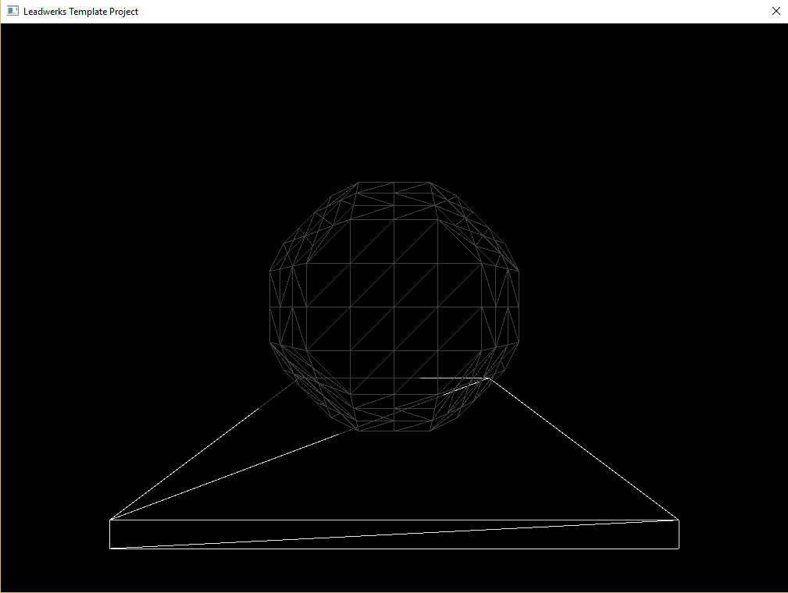

# Leadwerks Template Project
---

## Synopsis

A clean c++ template project written around the Leadwerks API, providing an easy to use platform for interactive application development.

## Motivation

I began using Leadwerks for c++ game development in June 2013 and have been a fan ever since. Over the last few years, I have been developing a modular game architecture, providing a clean and easy to use framework for game development. The Leadwerks Template project is my aim to help streamline other c++ developers looking to enter game development with the opportunity to quickly iterate quality projects with an easy to use development pipeline.

### Setup

To use the template project in your own application you should first create a new project through the Leadwerks Project Manager. You can then pull or extract the template files into the root directory of your project. This will be the same directory that contains the asset directories that are created for you when you create a new Leadwerks project.

NOTE: Make sure that your .csproj working directory is pointed to the same directory your assets are located as well. This should be set for you when your project is initially created however, should your application crash due to missing script files, you should check your working directory.

## Versions

v0.0.4 - Complete overhaul of the template framework. Introduced AppController class. Refactored GameObject system for an Entity-Component system. Introduced Dependency Injection with Container class. Added brief documentation to all source files. Removed contents section from the readme.md. Added LuaTables++ to project. Finalized a quick sample scene to demonstrate the use of the Component system with lua scripts. Also added support for Squirrel Script though not officially supported at this time.

v0.0.3 - Added EventManager class with example event to project. 

v0.0.2 - Contains the added Game Object, Camera Manager, Input Manager and State Manager, providing a complete game-application template. This can be used if you want to start getting right into game development, without having to wire up base requirements for an application.

v0.0.1 - Contains refactored App.h and App.cpp source files, providing a complete boilerplate application. This can be used if you want to build your own application from scratch.

## License

Copyright (c) 2013 2014 2015, 2016 Eden Softworks Joshua J Allen
	
This software is provided 'as-is', without any express or implied
warranty. In no event will the authors be held liable for any damages
arising from the use of this software.

Permission is granted to anyone to use this software for any purpose,
including commercial applications, and to alter it and redistribute it
freely, subject to the following restrictions:

1. The origin of this software must not be misrepresented; you must not
   claim that you wrote the original software. If you use this software
   in a product, an acknowledgement in the product documentation would be
   appreciated but is not required.
2. Altered source versions must be plainly marked as such, and must not be
   misrepresented as being the original software.
3. This notice may not be removed or altered from any source distribution.
